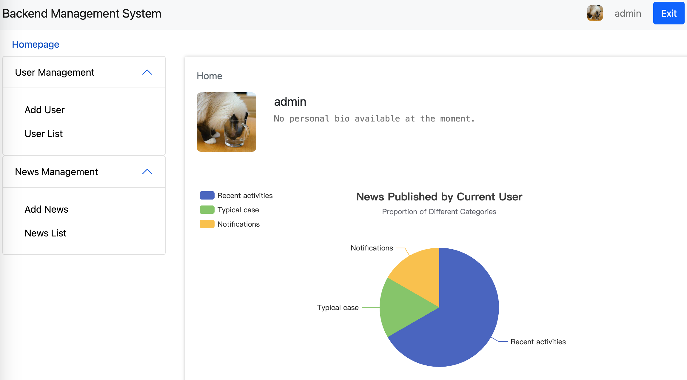
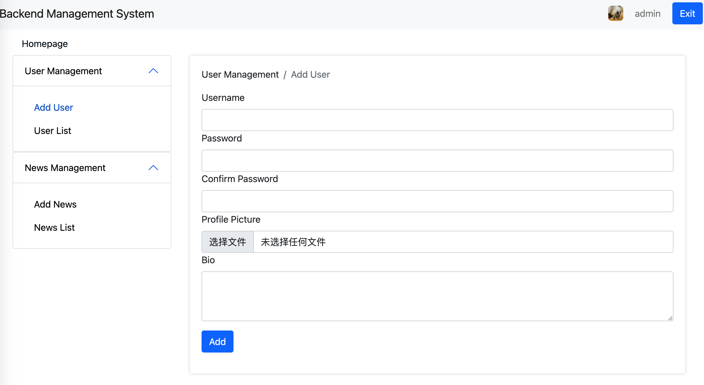
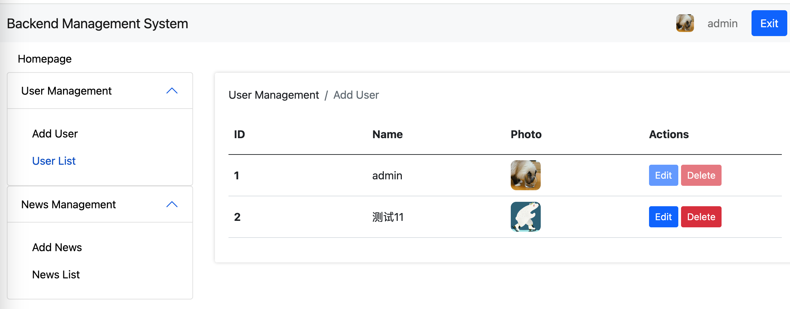
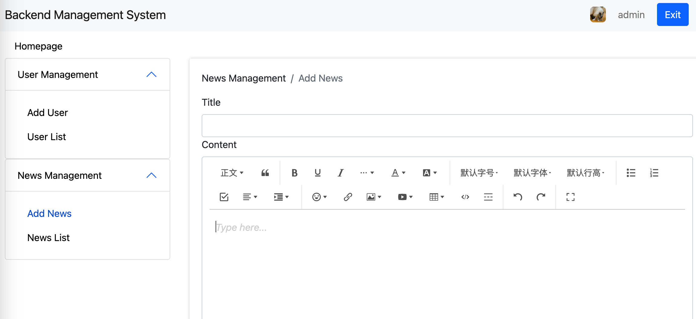
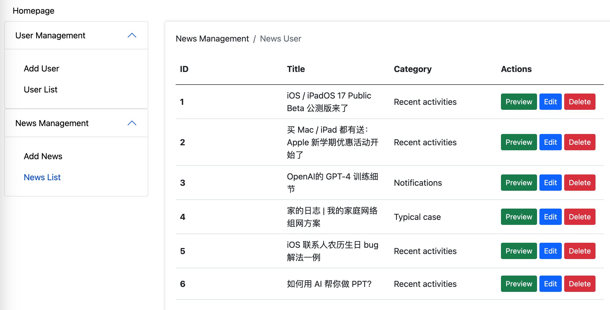

# Company-Website
# Enterprise Website Template

This is an enterprise website template built using Bootstrap framework and js-server as a simulated database. The template consists of both frontend and backend components, with data analysis powered by Echarts and rich text editing capabilities provided by wangEditor.

## Preview

### Frontend
<details>
  <summary>Products</summary>
    
</details>
<details>
  <summary>News</summary>
    
</details>

### Backend
<details>
  <summary>Homepage</summary>
    
</details>
<details>
  <summary>User Management</summary>
    
    
</details>
<details>
  <summary>News Management</summary>
   
    
</details>


## Project Organization

### Backend

- Login module
- Dynamic loading of navigation bar and sidebar
- Home page - Data analysis
- User management
  - Add user page
  - User list page: Edit and delete users
- News management
  - Add news page
  - News list page: Preview, update, and delete news

### Frontend

- Navigation bar
- Products page: Product services
- News page
  - News search
  - News list
  - News categories
  - News details

## How to Use

1. Install dependencies:

   ```
   npm install -g json-server
   ```

2. Start the js-server:

   ```
    json-server ./db.json --watch
   ```

3. Open your browser and visit `http://localhost:3000` to view the enterprise website template.

## Technology Stack

- Bootstrap
- Scss
- js-server
- Echarts
- wangEditor

## Contribution

Contributions, questions, and suggestions are welcome. Please submit a Pull Request to collaborate on improving this project.

## License

This project is licensed under the [MIT License](LICENSE).